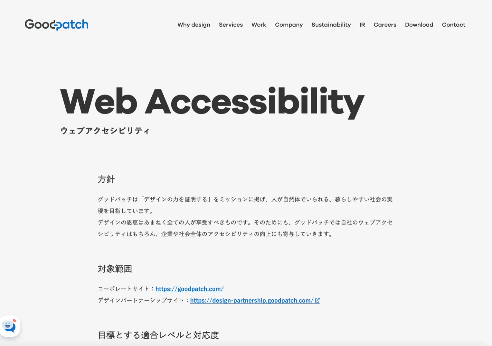

# 組織で取り組むアクセシビリティのはじめ方

本資料は、2025 年 6 月 27 日に行われた「[各社の事例に学ぶ！アクセシビリティを向上させる開発プロセス](https://findy.connpass.com/event/358706/)」のイベントで[発表した資料](https://speakerdeck.com/masakiohsumi/zu-zhi-dequ-rizu-muakusesibiriteinohazimefang)の文字起こし版です。

---

# 自己紹介

- 大角 将輝（株式会社グッドパッチ / Engineering Manager）
- 2016 年にグッドパッチにフロントエンドエンジニアとして入社し、主にクライアントワークで複数の開発プロジェクトを経験。現在はエンジニアリングマネージャーとして事業や組織にも関わりながら、自社のアクセシビリティ推進メンバーとして、さまざまなアクセシビリティの活動に取り組んでいる。

# グッドパッチについて

- 顧客体験を起点に企業変革を進めるデザインカンパニー

## 事業領域

### デザインパートナー事業

- Goodpatch: 高度なデザインスキルと事業ノウハウを持ち合わせたハイコミットメントなチーム
- STUDIO DETAILS: ブランディング戦略から幅広い領域の制作が可能なクリエイティブ集団
- Goodpatch Anywhere: 専門性の高いフリーランスをパートタイムでアサイン柔軟なチーム組成が可能

### デザインプラットフォーム事業

- ReDesigner: デザイナー特化のキャリア支援サービス
- ReDesigner for Student: デザイナー志望の学生と企業のマッチングプラットフォームサービス
- Strap: オンラインホワイトボードツール
- People and Design: HR コンサルティング / AI ソリューション

# グッドパッチのアクセシビリティ推進について

## アクセシビリティ推進の概要

### なぜ取り組むのか？

デザイン会社として、より多くの人に情報やサービスを提供するため

### いつから？

2024 年 4 月に 3 名で「アクセシビリティ推進プロジェクト」を発足

### どのように進めるのか？

週次の定例でアクセシビリティに関する施策を企画・実行する

## 組織的にアクセシビリティに取り組むことになった背景

1. 以前から社内にはアクセシビリティに関心のあるメンバーがおり、個人の努力によって支えられていたが、組織的には取り組めていなかった
2. 2024 年 4 月の「障害者差別解消法」の改正・施行をきっかけに、マネジメントメンバーを中心にアクセシビリティの取り組みについて検討を開始
3. アクセシビリティに専門性があるメンバーの採用も追い風になり、組織としてアクセシビリティに取り組むことをトップダウン的に決める

## これまでの取り組み

### 自社のアクセシビリティ方針策定

- ウェブアクセシビリティ方針の策定と公開
- 方針に基づいた検査実施と検査結果の公開
- 検査で見つかった課題の改善 (進行中)

### **社内勉強会の開催**

- これまで 3 回の勉強会を開催
- 延べ 70 名以上のメンバーが参加
- 勉強会の満足度は 5 段階中 4 以上が 100%

### **社内のしくみの整備**

- 社内向けガイドラインの整備（進行中）
- 自社デザインシステムのレビュー（進行中）

### **ブログ執筆・イベント参加**

- 社内向けブログ 18 本、社外向けブログ 10 本
- 2025 年は GAAD Japan に登壇と協賛

# **組織で取り組むアクセシビリティのはじめ方**

## **組織でアクセシビリティに取り組むためのハードル**

1. アクセシビリティに取り組みたいけど、どのように進めればいいのか分からない
2. 他部署や上司など、周囲の人から必要性を理解してもらえず、巻き込むのが難しい
3. アクセシビリティの対応は義務ではないので、改善の優先度が上がらない

## アクセシビリティに組織で取り組むための４つのステップ

1. 個人の努力ではなく、アクセシビリティを推進するチームをつくる
2. 社内の理解促進と協力を得るために社内勉強会を開催する
3. 自社の改善を進めるためにアクセシビリティ方針を策定する
4. 機会やフィードバックを得るために自社の取り組みを社内外に発信する

## 1. 推進チームをつくる

### メンバー主導型のアプローチ

1. アクセシビリティの情報共有の場をつくる（Slack など）
2. アクセシビリティに関心のある人を集めて声をかける

### **マネージャー主導型のアプローチ**

1. 社内からアクセシビリティに関心がある人を募る
2. 社外からアクセシビリティに関心がある人を採用する

✍️ **熱量が高いメンバーを集めることが大事**

## **2. 社内勉強会を開催する**

### **社内勉強会のプロセス**

1. アクセシビリティに興味のあるメンバーを集めて、全職種向けにカジュアルなイベントを開催する
2. 会社全体のアクセシビリティの理解を促進するとともに、推進活動の PR や協力依頼をする

✍️ **幅広い職種や階層の人に参加してもらうことが大事**

参考：[全職種向けに開催！組織で理解を深める「アクセシビリティ社内勉強会」レポート｜ Goodpatch Blog](https://goodpatch.com/blog/2024-05-accessibility-study)

## **3-1. アクセシビリティ方針を策定する**

### **アクセシビリティ方針策定のプロセス**

1. 自社がアクセシビリティに取り組むべき理由を整理し、会社として取り組むことに合意する
2. 「ウェブアクセシビリティ方針策定ガイドライン」を参考に自社の方針（草案）を作成する

✍️ **自社のビジョン/ミッションとアクセシビリティを紐づけるのが大事**

参考：[Web Accessibility ｜ Goodpatch グッドパッチ](https://goodpatch.com/web-accessibility)

## **3-2. アクセシビリティ方針を公開する**

### **アクセシビリティ方針公開のプロセス**

1. アクセシビリティ方針／検査結果を経営陣に共有する場をつくり、方針の公開について合意を得る
2. 自社のコーポレートサイトでアクセシビリティの方針／検査結果を公開する

✍️ **共有する場をつくるために、経営と近い人とのつながりが大事**

アクセシビリティの方針を代表の土屋に説明している様子

参考：[組織で取り組むアクセシビリティのはじめ方 - Goodpatch Tech Blog](https://goodpatch-tech.hatenablog.com/entry/how-to-start-accessibility-in-organization)

## **4-1. 自社の取り組みを社外に発信する**

### **社外向けに発信した情報の例**

- 社内勉強会レポート
- アクセシビリティ方針
- アクセシビリティ検査結果
- ガイドライン作成の取り組み
- ウェブアクセシビリティの調査で得た知識

✍️ **社外に発信することで、新たな機会やフィードバックにつながる**

参考：アクセシビリティ関連の [Goodpatch Blog](https://goodpatch.com/blog/tag/accessibility)、[Goodpatch Tech Blog](https://goodpatch-tech.hatenablog.com/archive/category/Accessibility)

## **4-2. 自社の取り組みを社内に発信する**

### **社内向けに発信した情報の例**

- アクセシビリティ推進プロジェクトの紹介
- 障害者差別解消法の改正について
- アクセシビリティイベント参加レポート
- 自社サイトのアクセシビリティ検査・改善報告
- 各国のアクセシビリティ関連法規

✍️ **情報発信することで、社内の理解促進＋自分たちの理解も深まる**

自社サイトのアクセシビリティ検査の過程を社内にも共有

## **どうやって活動を継続する？**

1. 完璧を目指すのではなく、継続することを重視する
2. 定期的にアウトプットすることを重視する
3. 障害当事者の人のことを知る・つながる

### **障害当事者の人のことを知る・つながる**

[当事者と一緒に考えるアクセシビリティ グッドパッチのプロダクト開発 - YouTube](https://www.youtube.com/watch?v=uS8Ie9AKlKg)

アクセシビリティのイベントに参加する（[弊社の maddy さんによるイベントまとめ](https://x.com/manasugiyoshi/status/1929325504907415822)）

**当事者の理解を深めることで、アクセシビリティを具体的なニーズとして捉えることができる**

## **マネージャーの役割とは？**

1. アクセシビリティに情熱のある人を探す（社内から募る、社外から採用する）
2. 「会社や事業の目標」と「推進チームの目標」をつなげる
3. 組織の構造を超えて、他部署や経営と連携する

# まとめ

## **アクセシビリティに組織で取り組むための４つのステップ**

1. 個人の努力ではなく、アクセシビリティを推進するチームをつくる
2. 社内の理解促進と協力を得るために社内勉強会を開催する
3. 自社の改善を進めるためにアクセシビリティ方針を策定する
4. 機会やフィードバックを得るために自社の取り組みを社内外に発信する

**グッドパッチのアクセシビリティの取り組みはまだまだ発展途上ですが、引き続き頑張ります…！🔥**

# **Thank you for your attention!**

これから組織でアクセシビリティに取り組みたい方の参考になれば幸いです。

グッドパッチでは、アクセシビリティに取り組みたい[デザイナー、エンジニアを募集](https://goodpatch.com/careers)しています！

# **参考情報**

## Goodpatch Blog

1. [【2025 年最新】ウェブアクセシビリティで対応すべきことは？障害者差別解消法改正との関連性](https://goodpatch.com/blog/2024-03-accessibility-todo)
2. [全職種向けに開催！組織で理解を深める「アクセシビリティ社内勉強会」レポート](https://goodpatch.com/blog/2024-05-accessibility-study)
3. [大逆転の熱と起点をつくる社員体験デザイン。2024 年度下半期グッドパッチグループ総会](https://goodpatch.com/blog/2024-10-allhands-drive180)
4. [アクセシビリティに取り組まないと、企業はどれくらい「損」をする？　試算する方法をご紹介](https://goodpatch.com/blog/2024-10-accessibility-cost)
5. [デザイン会社でエンジニア、キャリア的なメリットは？　マネージャーに聞いてみた](https://goodpatch.com/blog/2024-12-kumamon)
6. [見た目だけでなくコードまで、アクセシビリティまで、良いデザインを ── フロントエンドエンジニア maddy](https://goodpatch.com/blog/2025-03-maddy)
7. [逆転劇を起こすのは自分自身、6 人が語った挑戦は ──2025 年度上半期グッドパッチグループ総会](https://goodpatch.com/blog/2025-03-sokai)
8. [デザイナーのための WCAG の歩き方](https://goodpatch.com/blog/learn-wcag)
9. [排除を考えることから始めるインクルーシブデザイン](https://goodpatch.com/blog/inclusive-design)

## Goodpatch Tech Blog

1. [5 分ではじめる、iOS のアクセシビリティ対応](https://goodpatch-tech.hatenablog.com/entry/ios-5min-accessibility)
2. [アクセシビリティ推進のための社内ハンドブック作成事例](https://goodpatch-tech.hatenablog.com/entry/accessibility-handbook)
3. [組織で取り組むアクセシビリティのはじめ方](https://goodpatch-tech.hatenablog.com/entry/how-to-start-accessibility-in-organization)
4. [初めて VoiceOver を対応する人におすすめの WWDC セッション](https://goodpatch-tech.hatenablog.com/entry/2022/12/12/115855)

## **グッドパッチの「よはく」- YouTube**

1. [当事者と一緒に考えるアクセシビリティ グッドパッチのプロダクト開発](https://www.youtube.com/watch?v=uS8Ie9AKlKg)
2. [どうしてクライアントワークでアクセシビリティに取り組むの？キャビンアテンダントからエンジニアに。グッドパッチのプロダクト開発](https://www.youtube.com/watch?v=fJVh1y07eUc)

# 本資料に関する問い合わせ先

- [@cawpea](https://x.com/cawpea)
